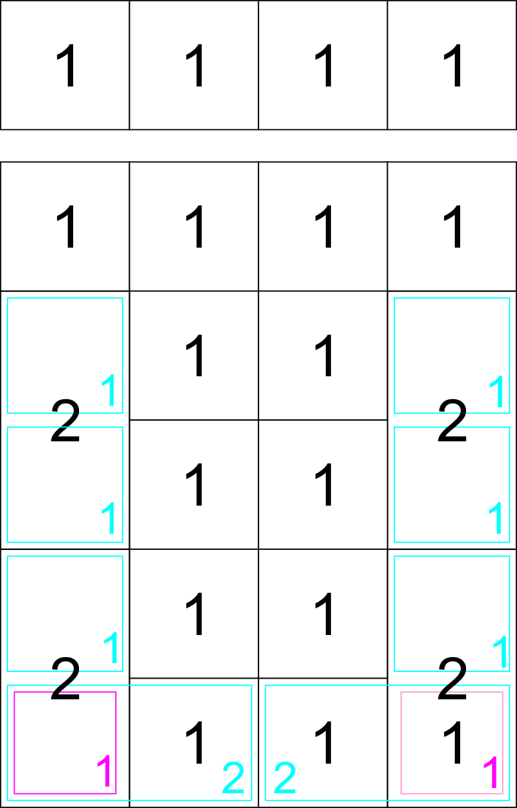

# SAMPad

This is a custom numeric pad that is designed to be usable on the right side of the keyboard or on the left (With a mirrored layout if required).
There is a gap in the top row and the second row of 1.25U. The top row can be broken off by simply scoring the two brifges and snapping.
The bottom 5 rows can then be used in conjunction with a 60%/65% keyboard.

SAMPad stands for Sundstrand Adding Machine. David Sundstrand was the inventor of the 10-key adding machine, the layout of which is used till date on most numeric pads. This is a humble dedication to the great man.

#Features
- Open Source Design
- Fully Programmable Keys
- Numpad can be mirrored for use on the left side of the main keyboard.
- Multiple layers
- Alps/Cherry (PCB/Plate) support
- PCB mount stabs supported
- Backlight, LED on bottom for windowed keycaps
- 6 Indicator LEDs, 4 on the top row and one on either Num Lock positions (Regular and mirrored)
- 4 SMD RGB LEDs on the bottom of the PCB for under/side glow
- SMD (SOD-123) diodes only
- Individual resistors for the LEDs not required as it uses a dedicated LED driver
- Using large (0805) capacitors and resistors so it is easier to hand-solder
- Possibility to add a buzzer
- Possibility to add a rotary dial on the top-right most key position for changing volume, LED brightness, etc.

#Layout options decided/implemented:
- Standard numpad with extra row on top with a 1.25U vertical offset that matches most TKL boards.
- Possibility for upto 5*4 + 4 keys layout
- Mirrored numpad layout for use on left side of main keyboard

In the below image you can see the different options available.

